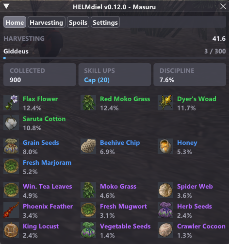
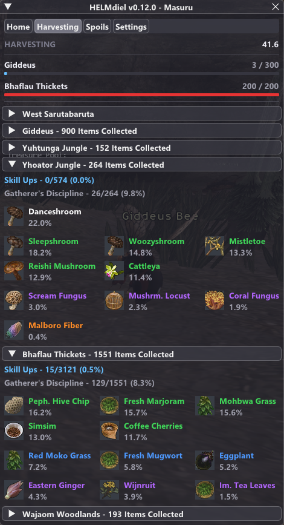
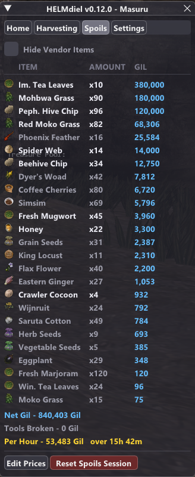
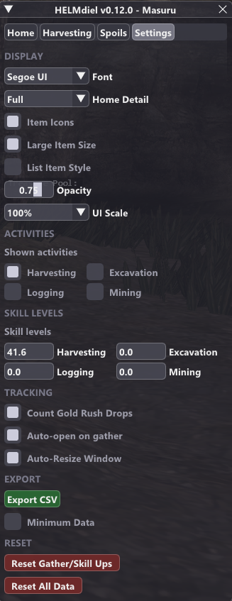

# HELMdiel

Tracks HorizonXI's HELM system: Harvesting, Excavation, Logging and Mining.

Per-zone fatigue counters, skill levels read from your own skill-up messages,
drop logging with icons and rarity tiers, a session tally with gil, and CSV
export.

Still in early development: expect bugs, and expect the UI to keep moving until
1.0.

Ashita v4.30+ addon. Version 0.12.0. Released under GPL-3.0. Coded with help
from Claude Opus 5.

## Screenshots

| Home | Harvesting |
|:---:|:---:|
|  |  |
| **Spoils** | **Settings** |
|  |  |

**Home** is the zone you are standing in; the **four activity tabs** are every
zone for one activity, drops behind a foldout; **Spoils** is the session tally
and its gil; **Settings** holds the display options and the export.

## Installation

**Requires Ashita v4.30 or newer.**

Download **HELMdiel.zip** from the
[latest release](https://github.com/KisamMeow/HELMdiel/releases/latest),
extract it into your Ashita `addons` directory, then:

```
/addon load HELMdiel
```

Take `HELMdiel.zip`, not the `Source code` archives — those extract to a folder
with the version number attached, which Ashita will not load until it is
renamed. To load it every time, add that line to `Ashita/scripts/default.txt`.

## Commands

`/hd` is a short alias for `/helmdiel` and takes all the same arguments.

| Command | What it does |
|---|---|
| `/helmdiel` | Toggles the window |
| `/helmdiel show` / `hide` | Shows or hides it |
| `/helmdiel debug` | Prints raw chat lines, for reporting detection problems |
| `/helmdiel names` | Lists any tracked item name that is not what your game calls it |
| `/helmdiel set <activity> <value>` | Sets the current zone's fatigue |
| `/helmdiel skill <activity> <value>` | Sets your skill level |
| `/helmdiel reset all` | Wipes everything for this character |
| `/helmdiel reset <activity>` | Wipes one activity, all zones |
| `/helmdiel reset <activity> zone` | Wipes one activity, current zone only |

## How fatigue works

Each activity has its own counter **per zone**, capped at 200 by default.

- A successful gather raises the current zone's counter by 1.
- The same gather lowers every **other** tracked zone by 1.
- At the cap the zone is done: nothing more can be gathered there until you
  work the same activity somewhere else.

So if Giddeus is capped and you harvest 100 times in West Sarutabaruta,
Giddeus falls to 100.

**Zones you have outskilled hold more.** For every 10 skill levels above a
zone's skill cap you get 50 extra fatigue there, so West Sarutabaruta, which
caps harvesting at 10, holds 300 once you are at 35. This only applies to zones
whose skill cap the addon knows; the rest stay at 200.

The counters are a model built from observed play, not a readout of the
server's real numbers, so gathering with the addon unloaded makes them drift.
`/helmdiel set` puts them back, and **the game corrects the drift itself**:
when it says a zone is tapped out, every other zone for that activity drops by
however far this one just jumped. For the same reason the red **FATIGUED**
label only appears once the game has actually said so — a counter sitting at
the cap may just have drifted.

Bar colours are a share of that zone's own cap:

| Colour | Fatigue | At a 200 cap | At a 300 cap |
|---|---|---|---|
| Light blue | below 75% | 0 to 149 | 0 to 224 |
| Yellow | 75% and up | 150 to 199 | 225 to 299 |
| Red | at the cap | 200 | 300 |

## Reading the window

Home covers only the zone you are standing in. Zones with two activities
(Yuhtunga and Yhoator Jungle) get a section for each.

```
HARVESTING                                                31.3

Giddeus                                              241 / 300
━━━━━━━━━━━━━━━━━━━━━━━━━━━━━━━━━━━━━━━━━━━━━━━━

  COLLECTED         SKILL UPS          DISCIPLINE
  241               7.1%               8.8%
```

Skill starts as `unknown`, because the game only reports it when it goes *up*.
Type it into Settings or wait for your next skill up.

**Items Collected** is everything logged in this zone, and it survives a
session reset so your drop percentages stay meaningful.

**Skill Ups** is how often a swing here raised your skill, or **Cap (20)**
once your skill reaches the zone's ceiling, since a rate stops meaning anything
once it cannot move. Only a few zones have a known cap. **Hover it** for the
numbers behind it and how many swings since your last skill up.

**The tiles after it are that activity's special skills**, one each — Mining
gets four, wrapped onto two rows, and Logging none. **Hover one** for the
ability's full name and the numbers behind its rate. Most count against the
Items Collected figure beside them; Practiced Technique counts against the
pickaxes that broke or would have, since it fires instead of a break. The
activity tabs carry the same rates inside each zone's foldout.

These rates start from 0.9.6, while Items Collected goes back as far as your
drop history does. **If you gathered before 0.9.6, use Reset All Data for an
accurate rate**, after exporting if you want to keep the drop data.

### Gold Rush

Gold Rush repeats one item until the node runs out. Those extra items are real
but they are not a fair sample of what the zone drops, so **Count Gold Rush
Drops** in Settings decides whether they count towards your drop percentages.
It is on by default. Either way they are always in your Spoils tally, and
hovering the Gold Rush tile lists exactly which items came from a node here.

HELMdiel follows the node itself rather than guessing from the item name, so
moving to another vein ends the run even if it gives the same ore.

### Drops

Each item's name is coloured by rarity, so you can read it without a label:

| Tier | Colour | Share of that zone's gathers |
|---|---|---|
| Common | White | 20% or more |
| Uncommon | Green | 10 to 19% |
| Rare | Blue | 5 to 9% |
| Very Rare | Purple | 1 to 4% |
| Extremely Rare | Orange | under 1% |

Items sort by how often they drop. **The percentages are only as good as your
sample** — twenty gathers will show wildly misleading tiers; give it a few
hundred.

**Items you have not found yet are listed too**, in grey below the rest, so a
zone shows what it can give rather than only what it has given: **Not seen**
means it drops here and you just have not got one, **Locked (10)** means it
needs that skill level first. Gather one and it moves up with its own
percentage whatever your skill says, because gathering it is proof you can.

Drop lists exist for every harvesting and excavation zone, 5 of 11 logging
zones and 4 of 9 mining zones. **A list is what is known so far, not a
guarantee it is complete** — a missing item shows up the first time you gather
it.

### Spoils

Everything gathered this session, whatever zone it came from, sorted by gil so
whatever paid most is at the top:

```
ITEM                   AMOUNT      GIL
[icon]  Sprig of Dyer's Woad   x12   14,400
[icon]  Bone Chip              x3       135

Net Gil - 14,235 Gil
Tools Broken - 300 Gil
Per Hour - 12,201 Gil   over 1h 10m
```

No rarity, just what you are carrying home. It survives reloading and logging
out.

**Tools Broken is every sickle, pickaxe and hatchet you got through this
session**, priced from the Tools block in Edit Prices. It comes off Net Gil,
and Per Hour divides the net. Leave the tools unpriced and nothing is deducted.

**Per Hour runs from your first gather to your last**, not to the current time,
so leaving the window open while you do something else does not drag it down.
Every reset that clears the tally clears the clock with it.

**Prices are yours to set**, since the game does not tell addons what anything
sells for. **Edit Prices** lists every gatherable item with a box beside it —
41 harvesting, 40 excavation, 30 logging, 39 mining, plus a **Tools** block for
the sickle, pickaxe and hatchet. They save as you type, are shared by all your
characters, and **no reset clears them**; anything unpriced counts as 0. An
item showing **(?)** instead of a box has a name your game does not
recognise — tell me which and it is a one-line fix.

**Tick Vendor beside an item** to mark it as something you just sell to an NPC.
Tools have no such box, since you never carry one home.
Those items read grey in the Spoils list while everything else reads white, so
what is actually worth carrying stands out. **Hide Vendor Items** on the Spoils
tab drops them from the list entirely — they still count towards Net Gil and
Per Hour, since hiding is only a view filter. Vendor marks are shared by all
your characters and no reset clears them, same as the prices.

## Settings

Hover any control for a one-line explanation.

| Setting | What it does |
|---|---|
| Font | Segoe UI, Consolas, Arial, Tahoma or Trebuchet MS |
| Home Detail | Full, Normal (no item list) or Compact (skill and fatigue only) |
| Count Gold Rush Drops | On by default. Off keeps a Gold Rush node's repeats out of your drop rates |
| Item Icons | Item art beside each drop. On by default |
| Large Item Size | Off gives smaller item art, and smaller item text with it |
| List Item Style | Off packs three items across instead of one per row |
| Opacity | How see-through the window is. Stops short of invisible |
| UI Scale | 75%, 100% or 125%. Text, icons and spacing together |
| Shown activities | Unchecking one hides its tab. Tracking continues |
| Skill levels | Type in a level the game has not told the addon yet |
| Auto-open on gather | The window pops up when you gather |
| Auto-Resize Window | On, it fits its contents. Off, drag the gold corner yourself |

**Export CSV** writes one row per item per zone, with that zone's drop rate,
fatigue and counters alongside, and prints its path in chat. Every export is
stamped with the date and time, so they pile up in order rather than
overwriting.

```
Ashita/config/addons/HELMdiel/<Character>_export_2026-08-16_134501.csv
```

**Minimum Data** cuts it to Activity, Zone, Item, Count, Zone Gathers, Drop
Rate and Skill, dropping your name, fatigue, attempts, successes and skill ups
so you can share drop data without attaching who you are. Skill stays, because
drop rates only mean something against the skill they were gathered at. Your
name comes off the filename too.

**Both reset buttons take two clicks.** The first arms it and the button asks
`Confirm?`; the second does the work. It disarms itself after a few seconds.

- **Reset Gather/Skill Ups** clears the Home counters and the Spoils tab, and
  starts a new session. Fatigue, drop history, skill levels and special skill
  counts are kept, since those last two are measured against the drop history.
- **Reset All Data** clears everything for this character.

## Detection

Detection reads your chat log, and **all four activities are verified against
real HorizonXI messages.** The one exception is the fatigue-cap message, seen
for harvesting and logging and assumed to match for excavation and mining.

Excavation and Mining both say "You successfully dig up", so HELMdiel tells
them apart by the zone you are in — which works because no zone appears in both
lists. Gather either in an untracked zone and it may be filed under the wrong
one.

If something is not being counted, run `/helmdiel debug`, gather with the tool
in question, and send the exact lines.

## Tracked zones

- **Harvesting**: West Sarutabaruta, Giddeus, Yuhtunga Jungle, Yhoator Jungle,
  Bhaflau Thickets, Wajaom Woodlands
- **Excavation**: Attohwa Chasm, Korroloka Tunnel, Maze of Shakhrami, Tahrongi
  Canyon
- **Logging**: Buburimu Peninsula, Carpenters' Landing, East Ronfaure, Ghelsba
  Outpost, Jugner Forest, Lufaise Meadows, Misareaux Coast, Yhoator Jungle,
  Yuhtunga Jungle, Caedarva Mire, Mamook
- **Mining**: Gusgen Mines, Halvung, Ifrit's Cauldron, Mount Zhayolm, Newton
  Movalpolos, Oldton Movalpolos, Palborough Mines, Yughott Grotto, Zeruhn Mines

Gathering outside these lists still tracks fatigue, but it is not shown and its
drops are not logged.

Data is stored per character at
`Ashita/config/addons/HELMdiel/<Character>_<id>/settings.lua`. Deleting that
file resets the character, same as `/helmdiel reset all`.

## Known limitations

- **The raised fatigue cap only applies to zones whose skill cap is known**,
  and that is 7 of the 30 tracked zones. Everywhere else the bar tops out at
  200, so if you have outskilled one of those zones the game will let you keep
  gathering after the bar looks full.
- **Skill up rates depend on your skill against a zone's cap**, which HELMdiel
  does not model. Rates recorded at different skill levels are not comparable,
  and a zone that looks slow may just be a poor match for your current skill.
- **The fatigue message is assumed to match for excavation and mining.** If
  either differs, that activity never shows the red FATIGUED label and its
  counters will not resync.
- Zone IDs use standard retail-compatible numbering and have not been checked
  one by one against HorizonXI's server.

## Feedback

**Zone skill caps are the most useful thing you can send**, since they drive
the fatigue ceiling and only 7 zones have one. Corrections to the message
patterns and zone lists are next, and `/helmdiel debug` output is ideal.

Open an issue at
[github.com/KisamMeow/HELMdiel/issues](https://github.com/KisamMeow/HELMdiel/issues),
or DM me on Discord. I am Masuru in HorizonXI.

## Thanks

There is no documentation for writing an Ashita addon that covers much beyond
the basics, so most of what HELMdiel does was learned by reading other people's
work. These are the addons it borrowed technique from, and what each one
taught it.

- **[Ashita](https://github.com/AshitaXI/Ashita-v4beta)** — atom0s and
  ThornyFFXI. The platform itself. Its bundled SDK annotations are the
  authority for every ImGui call in here, and reading them first has prevented
  more crashes than anything else.
- **[tHotBar](https://github.com/ThornyFFXI/thotbar)** — Thorny. Its texture
  cache is the model for HELMdiel's item icons: how to turn an item's raw
  bitmap into a Direct3D texture, and the interface-version guard that keeps it
  working across client builds.
- **[tCrossBar](https://github.com/ThornyFFXI/tCrossBar)** — Thorny. Ships the
  same texture code, which is how I knew the pattern was the settled one rather
  than a one-off.
- **[tTimers](https://github.com/ThornyFFXI/tTimers)** — Thorny. Likewise.
- **[XIUI](https://github.com/tirem/XIUI)** — Team XIUI. Its font handling is
  where the font picker comes from: the map of family names to the bold files
  Windows actually ships, and the rule that every face has to be baked when the
  addon loads rather than when someone picks it.
- **[HGather](https://github.com/SlowedHaste/HGather)** — Hastega. The
  outgoing HELM interaction packet, which is how HELMdiel knows *which
  gathering node* a swing was aimed at, and therefore when a Gold Rush run has
  really ended. It also independently confirmed one of the logging failure
  messages.
- **[HXUI](https://github.com/tirem/HXUI)** — Team HXUI (Tirem, Shuu,
  colorglut, RheaCloud). The render-flag test for whether an entity still
  exists, which is how a depleted node is detected.
- **[Timers](https://github.com/Lunaretic/Timers)** — Lunaretic, Shiyo, The
  Mystic. The same test, arrived at independently, which is what made me
  confident it was right.

Bugs in HELMdiel are mine, not theirs.

## License

HELMdiel is free software, released under the GNU General Public License,
version 3. See [LICENSE](LICENSE) for the full text.
